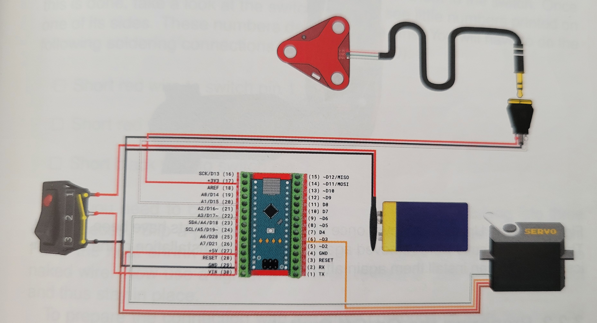
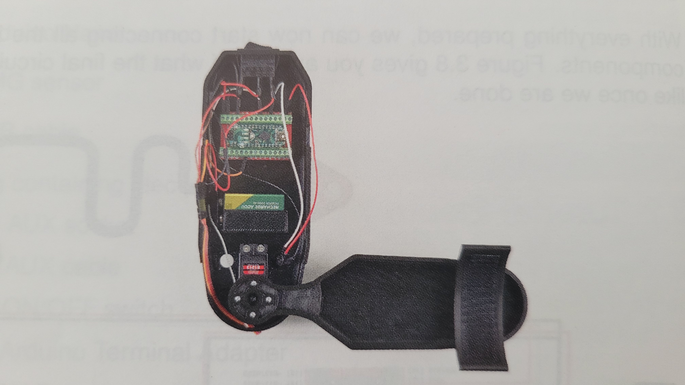

# Haptic-Interfaces-Parkinson-Tremor
Project for Haptic Interfaces Course by Corneel Meylaers and Antonio Crisol.

## 1. Introduction
**The medical context:** In current medical practice, Parkinson's disease-induced resting and action tremors present a significant challenge, severely impacting patients' quality of life and their ability to perform activities of daily living (ADLs) such as drinking or eating [1], [2]. It also has a large distressing impact on their social abilities and mental health, even in early-stage Parkinson's disease.

**The haptic advantage:** Haptic technology offers a multi-modal advantage by addressing both the physical and cognitive requirements of Parkinson's disease rehabilitation. Physically, active mechanical damping systems can dynamically counteract involuntary resting and action tremors in real-time, providing targeted resistance that dampens pathological oscillations without impeding a patient's voluntary motor intents [4]. Cognitively, haptic components can be simulated inside immersive virtual reality (VR) spaces to provide a safe, repeatable environment where patients practice essential activities of daily living (ADLs), such as pouring liquids, without the real-world frustration or mess of failure [6], [7].

By proposing a decoupled architecture where the physical exoskeleton (EduExo) and the virtual training software (Meta Quest 3S and Unity) operate entirely independently, this project actively fosters the key facilitators of assistive technology (AT) adoption [3]. This modularity lowers patient stress, minimizes hardware dependency, and aligns directly with individual user preferences and comfort, allowing the training system to serve as an accessible, non-stigmatizing assistive tool. This simple system also allows patients to exercise without the need for a doctor, which supports the reduction of clinical pressure [5].

**Existing solutions and gaps:** The WOTAS project already proved the possibility of suppressing tremors using a robotic exoskeleton [4]. It shows that applying internal forces, so-called haptic resistance, at the tremor frequency is a valid control strategy. However, comprehensive reviews of wearable tremor technologies highlight a persistent gap: these traditional rigid orthoses are frequently rejected by patients because their bulkiness, weight, and poor cosmetic appearance cause discomfort and social anxiety [9]. To address these limitations, the field is currently pivoting toward highly adaptive, intelligent control systems that better accommodate the user's natural motions [10]. This modern push for smart integration strongly supports our approach of using an EMG-driven control loop that targets unwanted tremors while seamlessly allowing voluntary movement.
Furthermore, there is a popular medication-based solution, namely Levodopa. While Levodopa remains the standard for managing Parkinson's disease, it comes with a severe long-term drawback known as Levodopa-Induced Dyskinesia (LID) [8]. This consists of severe, involuntary, and uncontrollable movements. This traps patients in a dilemma where lowering the medication dosage returns the tremors while raising it worsens the dyskinesia. This clinical trap strongly justifies the need for a physical, haptic exoskeleton to provide non-pharmacological tremor suppression.

## 2. Supplies (Bill of Materials)
To ensure full reproducibility, below is the comprehensive list of components required to build this prototype:

All estimated costs are provided in Euros (€).

### 1. Exoskeleton Core Kit

The physical exoskeleton, including all structural components, motors, and sensors, is sourced as a complete kit.

| Component | Description | Estimated Cost | Sourcing Link |
| :--- | :--- | :--- | :--- |
| **EduExo 2.0 (Lite Kit)** | Complete kit containing 3D-printed parts, cuffs, Arduino Nano, EMG sensor, motor, and cables. | ~€350.00 | [Auxivo Store](https://www.auxivo.com/product-page/eduexo-2-0) |

### 2. VR & Software Requirements

These components are required to run and develop the virtual reality simulation.

| Component | Description | Estimated Cost | Sourcing Link |
| :--- | :--- | :--- | :--- |
| **Meta Quest 3S (128GB)** | Standalone VR Headset for running the simulation. | €329.99 | [Amazon](https://www.amazon.de/s?k=meta+quest+3s) |
| **Unity Software** | Game engine used for VR development (Personal Edition). | €0.00 | [Unity Download](https://unity.com/download) |

### 3. Required Tools & Equipment

To fully assemble the EduExo 2.0 prototype, you will need the following workspace tools and equipment. These can be sourced from standard hardware stores or Amazon.

| Component | Estimated Cost | Amazon Sourcing Link |
| :--- | :--- | :--- |
| **Soldering iron & solder kit** | €15.00 | [Search on Amazon](https://www.amazon.de/s?k=soldering+iron+kit+with+solder) |
| **Helping hand tool** | €12.00 | [Search on Amazon](https://www.amazon.de/s?k=helping+hands+soldering) |
| **2 mm hex key (Allen wrench)** | €4.00 | [Search on Amazon](https://www.amazon.de/s?k=2mm+hex+key) |
| **Precision screwdriver set** | €10.00 | [Search on Amazon](https://www.amazon.de/s?k=precision+screwdriver+set+flat+cross) |
| **Wire stripping tool / side cutter**| €10.00 | [Search on Amazon](https://www.amazon.de/s?k=wire+stripping+tool+side+cutter) |
| **Crimp pliers / flat pliers** | €15.00 | [Search on Amazon](https://www.amazon.de/s?k=crimp+pliers+flat) |
| **Insulation tape** | €4.00 | [Search on Amazon](https://www.amazon.de/s?k=electrical+insulation+tape) |
| **9V Rechargeable batteries + charger**| €18.00 | [Search on Amazon](https://www.amazon.de/s?k=9v+rechargeable+battery+with+charger) |

---
*Note: Prices are estimates and may vary based on region, availability, and taxes (VAT).*

## 3. Methods

### 3.1 Conceptual Framework & Component Selection
The conceptual framework for our design relies on a modular, two-part system that can operate entirely independently:
1. **Physical Haptic Interface:** The conceptual framework for our design relies on a localized, active haptic interface utilizing the EduExo kit. The primary objective of this project was to develop a wearable, robotic exoskeleton capable of estimating user movement intentions and providing active physical support. To achieve this, an external surface Electromyography (EMG) sensor was chosen as the primary input mechanism. This allows the system's control logic to read the electrical activity of the user's muscles and differentiate between resting states and deliberate movement. The Arduino Nano was selected as the foundational microcontroller due to its compact form factor, native analog-to-digital converters, and capacity to handle pulse-width modulation (PWM). For the output actuation, a servomotor was utilized. This specific motor features an integrated potentiometer, which acts as a joint angle sensor, allowing the system to form a closed-loop position controller by constantly comparing the desired angle with the motor's actual physical state.

2. **Virtual Training Environment:** The primary objective of this part of the project was to develop a realistic, accessible, and standalone Virtual Reality (VR) pouring simulation for patient rehabilitation and training. To achieve this, the Unity 3D Engine was used as the foundational software environment. Unity provides a robust, built-in physics engine and modular C# scripting, which are essential for simulating realistic fluid dynamics, tracking particles, and managing object collisions in real-time.
For the VR integration, the Meta Quest SDK was utilized. This SDK provides highly optimized, pre-configured interaction logic, such as hand-tracking and grab mechanics, which drastically accelerated and facilitated the prototyping phase. In order to use this SDK, a standalone Meta Quest headset was selected. This also has major advantages over a standard PC headset, as operating the application natively on the headset removes the constraint of physical cables, thereby maximizing accessibility, safety, and freedom of movement for patients during their rehabilitation exercises.

### 3.2 System Architecture

*(Electrical Schematic of the EduExo exoskeleton)*

As shown in the schematic above, the systems are deliberately decoupled. The exoskeleton operates on a localized control loop via the Arduino microcontroller running the EMG classification code, while the VR simulation runs entirely on the Meta Quest 3S hardware. The motor controller regulates the haptic resistance based on the real-time EMG threshold data.

The system architecture of the exoskeleton is designed around a highly localized, untethered, closed-loop control system. To ensure maximum mobility and user safety, the entire hardware suite is decoupled from grid power and operates independently via an onboard 9V battery power supply.

The architecture follows a three-tier logic flow: Input, Logic, and Output.

* **Input Layer:** The system relies on two primary streams of continuous data. First, user movement intentions (force) are captured via surface electrodes attached to the forearm muscles; this biological data is amplified by the EMG sensor board and sent as an analog voltage signal to the Arduino Nano. Concurrently, the servomotor’s integrated potentiometer acts as a joint angle sensor, sending real-time positional feedback data back to the microcontroller.

* **Logic Layer:** The core behavior of the exoskeleton is governed by custom C++ control scripts running on the Arduino Nano. The system utilizes an admittance control strategy. The high-level controller reads the raw muscle activity to estimate the user's intended movement. This reading is compared against a predefined activation threshold. If the signal exceeds the threshold, the high-level controller calculates a desired joint angle. This desired position is then passed to the low-level position controller, which computes the difference (position error) between the desired angle and the actual angle measured by the motor's potentiometer.

* **Output Layer:** Once the logic layer computes the necessary mechanical support, the low-level controller sends pulse-width modulation (PWM) commands to the servomotor. The motor acts as the physical plant, driving the 3D-printed exoskeleton structure to flex or relax the user's elbow joint based on the calculated parameters, thereby completing the closed loop.

For the VR system, the same three-tier flow applies:

* **Input Layer:** User interactions and spatial positioning are captured by the OVR Camera Rig, translating real-world hand and head movements into the virtual space.
* **Logic Layer:** The core rules of the simulation are governed by Unity’s physics engine working together with custom C# scripts. The `GlasHaptiek` script detects individual fluid particles as they enter predefined collision zones. This data is passed to a centralized `ScoreManager` script, which calculates the user's pouring accuracy. Additionally, a `ResetKnop` script acts as the master state controller, managing the spatial data of all interactive elements.
* **Output Layer:** This includes the visual rendering of the fluid, real-time UI text updates on a physical in-game scoreboard, and audio/haptic feedback triggered upon object collisions and pouring.

### 3.3 Construction & Programming

*(Fully Assembled EduExo)*

Building the physical prototype required precise electronic assembly and mechanical routing to ensure both safety and functionality:

**Hardware Integration:** The exoskeleton's circuitry was built around an Arduino Terminal Adapter. This adapter eliminated the need for complex breadboard wiring and allowed for secure, semi-permanent screw-terminal connections for the peripheral components. The power circuit was constructed by soldering a 9V battery connection cable to a physical ON/OFF switch. To prevent short circuits, 4.8 mm heat-shrink tubing was applied to insulate all exposed soldered joints. Similarly, the AUX socket, which receives the analog signal from the EMG sensor, was prepared by stripping the wires and connecting them to the designated pins on the Terminal Adapter (Signal to an analog pin, alongside 3.3V power and Ground). To maintain an ergonomic and safe profile, all internal electronics were routed through designated channels inside the 3D-printed Upper Arm Cover, ensuring that motor wires and AUX cables did not impede the user's range of motion or get caught in the rotating joints.

**Control Logic & Software Implementation (Arduino):**
The logic required careful C++ programming within the Arduino IDE to handle the dynamic nature of human muscle signals. The software implementation was broken down into several key functional requirements:
* **Signal Mapping:** Raw EMG data is highly variable. To make the exoskeleton responsive, we utilized the Arduino map function to proportionally convert the raw analog input range directly into safe servomotor angles. This ensured that a stronger muscle contraction naturally resulted in a proportionally larger flexion from the motor, imitating an intuitive biological response.
* **Admittance Control & Thresholding:** Because resting muscles still produce baseline electrical noise, the motor would naturally jitter without a software filter. A hardcoded threshold variable was introduced to the main loop. The program actively reads the incoming signal and only engages the servomotor when the user's muscle activity explicitly exceeds this noise floor. If the signal is below the threshold, the motor remains passive, allowing free movement.
* **Source Code:** The complete source code for the microcontroller is available in the repository as an `.ino` file.

**Virtual Reality Construction & Programming (Unity):**
The practical construction of the VR prototype prioritized ergonomics and physical realism. The work surface, bottle, and glasses were positioned at a standard ergonomic height (Y ≈ 0.8). To ensure a reliable program and prevent users from accidentally walking off the virtual floor plane, an "invisible wall" was constructed using primitive cubes with disabled `Mesh Renderers` and active `Box Colliders`.

To simulate realistic glass-on-glass interactions, the bottle and glasses were equipped with Rigidbodies (mass) and Colliders (solid surfaces). A custom Unity Physics Material was created with zero bounciness and low friction properties, ensuring the objects interacted with an abrupt, hard impact typical of real glass.

The simulation logic required careful programming to handle edge cases and scalability:
* **Accuracy Logic:** The `ScoreManager` script originally calculated accuracy by dividing the water in the glass by the total water poured, causing a visual bug showing "100% accuracy" before pouring occurred. This was restructured using conditional statements (`if (totaalWater == 0)`) to display a placeholder (`--%`) until the first particle triggers the system.
* **Scalable Resets:** To accommodate varying difficulty levels, the `ResetKnop` script utilizes C# arrays (`[]`) to efficiently store, iterate through, and recall the exact startup positions and rotations of multiple glasses simultaneously.
* **Source Code:** All custom C# scripts and scene assets governing the VR physics and scoring logic can be found in the uploaded Unity folder within this repository.

### 3.4 Hardware Constraints & Troubleshooting
During iterative development and testing of the exoskeleton, several hardware constraints were identified. Resolving these required strict safety protocols, precise physical calibration, and software-level filtering to ensure a stable user experience.

**Electrical Safety & Short Circuits:** Wearable exoskeletons introduce significant risks if subjected to power surges or exposed wiring. To mitigate this, grid power was strictly prohibited during operation; the system was constrained entirely to a limited-current 9V battery. During the initial electronic assembly, short circuits were a primary concern. Our standard troubleshooting protocol involved verifying the power state via the onboard LEDs. If the LEDs failed to illuminate, or if components began to heat up, the system was immediately powered down. Diagnostics involved visually inspecting the Terminal Adapter, the AUX socket connections, and ensuring all exposed wire interfaces were fully isolated by the 4.8 mm heat-shrink tubing.

**Signal Noise and Sensor Placement:** Surface Electromyography (EMG) sensors are intrinsically susceptible to noise, crosstalk from surrounding muscles, and poor skin contact. Early testing revealed highly erratic, unpredictable motor behavior if the electrodes were placed improperly. This constraint was resolved by enforcing a strict sensor placement protocol: the two measuring electrodes were aligned directly over the part of the active muscle and under the arm strap, while the reference electrode was placed on an electrically neutral, bony area near the elbow. This ensured the reference node did not inadvertently record conflicting muscle activity, thereby cleaning the baseline signal.

**Baseline Jitter and Threshold Calibration:** Even with optimized electrode placement, resting human muscles continuously produce low-level electrical noise that can cause the servomotor to constantly twitch or behave in a jittery manner. To resolve this, we utilized the Arduino IDE's Serial Plotter to visually monitor the raw analog signal during both resting and flexing states. This data allowed us to accurately calibrate a hardcoded threshold variable within our control logic. The software was refined so that the servomotor actively disengages when the signal falls below this threshold, ensuring the motor remains entirely passive and stable until a deliberate, meaningful muscle contraction is executed by the user.

During iterative development of the Simulation software, several technical constraints were identified and resolved to ensure a stable user experience:

* **Tracking Origin Constraint:** Early testing revealed a calibration issue where the virtual table appeared to float at chest height because the headset tracking origin defaulted to *Eye Level*. This was resolved by forcing the OVR Manager to use *Floor Level* tracking.
* **Physics Ghosting:** The default grab mechanics caused held objects to become *Kinematic* (ignoring the physics engine). When holding the bottle and glass, they phased through one another. This was resolved by disabling `Kinematic While Selected` and utilizing *Velocity Tracking*, forcing objects to follow hands using physical forces rather than teleportation.
* **Momentum During Reset:** Resetting a falling object simply teleported it to the table, but it retained its downward momentum and instantly shot through the virtual wood. This was corrected by refining the reset function to explicitly access each object's `Rigidbody` and set both `velocity` and `angularVelocity` to `Vector3.zero` during teleportation.
* **Exhibition Casting Constraints:** For public demonstrations and clinical supervision, mirroring the headset view to an external monitor was required. To bypass the high latency of public Wi-Fi networks, a hardwired USB-C connection utilizing the **Meta Quest Developer Hub (MQDH)** was implemented, guaranteeing high-quality, zero-latency casting.

## 4. Discussion
4. Discussion
Upon testing the prototype, the dual-system approach successfully demonstrated the viability of a decoupled rehabilitation environment. The VR simulation provided an accessible, stress-free tracking space for the pouring task, while the EduExo prototype established a functional proof-of-concept for EMG-driven active resistance.

However, practical testing revealed several significant hardware and mechanical constraints that limited the exoskeleton's overall efficacy:

**EMG Signal Volatility:** The surface EMG sensor readings were often faulty. Because EMG relies on skin-surface measurements, the signal was easily disrupted by minor shifts in electrode placement, sweat, and electrical crosstalk from neighboring muscle groups. This volatility occasionally made it difficult for the control logic to distinguish between a pathological tremor and a deliberate movement.

**Actuator Torque Limitations:** The standard servomotor provided in the EduExo kit lacked the necessary torque to effectively counter forceful human movements. While it could demonstrate the concept of haptic resistance, it was easily overpowered by the user, meaning it could not generate the firm, rigid damping required to suppress a severe Parkinsonian tremor in a real-world clinical scenario.

**Structural Compliance (Mechanical Slop):** The physical exoskeleton frame was not stiff enough to transfer forces efficiently. The flexibility of the 3D-printed components, combined with the soft Velcro strapping, created "mechanical slop" (room for unintended free movement). Consequently, even when the motor attempted to apply corrective resistance, the parasitic movement within the frame absorbed much of the force before it could reach the user's arm.

Despite these hardware limitations on the physical side, having a separated VR environment is highly beneficial. It is significantly less stressful for users, as a physical water-pouring failure during an involuntary tremor spike did not result in an actual mess, allowing them to focus entirely on their motor control.

## 5. Conclusion and Future Work
In summary, the most significant aspect of this prototype is its modularity: providing physical assistance and virtual assessment as standalone or complementary tools. The project successfully validates the control strategy of using EMG inputs to drive a haptic orthosis, while effectively offloading the cognitive and spatial training to an immersive, risk-free Meta Quest 3S environment.

However, to transition this prototype from an educational proof-of-concept into a clinically viable medical device, the physical hardware requires substantial upgrades. For future development, we suggest the following improvements:

**Hardware Reinforcement:** To eliminate mechanical slop, future iterations should replace standard 3D-printed plastics with rigid materials (e.g., carbon fiber or aluminum) and utilize rigid, dial-adjusted cuffs (like BOA systems) to ensure zero free movement between the user's arm and the exoskeleton, while maintaining the low weight.

**Actuator Upgrades:** The servomotor can be replaced with for example a high-torque brushless DC (BLDC) motor paired with a low-backlash planetary gearbox to provide the robust, instantaneous force required to physically halt tremors. A strong enough stepper motor might also provide some opportunities.

**Advanced Signal Processing:** To address the erratic sensor data, we suggest refining the EMG processing by implementing active hardware filtering, or training a machine-learning model to better recognize and adapt to patient-specific tremor profiles amidst signal noise.

**System Integration:** Integrating Bluetooth communication between the two systems so the VR simulation can record and log the real-time force data generated by the physical exoskeleton. This can provide doctors with measurable metrics on the patient's progress without having the patient going to the hospital.

## 6. References
[1] L. E. Heusinkveld et al., "Impact of Tremor on Patients With Early Stage Parkinson's Disease," Front. Neurol., vol. 9, p. 628, Aug. 2018.

[2] R. A. Hauser et al., "Burden of tremor in Parkinson's disease: A survey study," J. Parkinsons Dis., vol. 15, no. 3, pp. 541-551, Mar. 2025.

[3] S. Malden et al., "Patient and Carer-Related Facilitators and Barriers to the Adoption of Assistive Technologies for the Care of Older Adults: Systematic Review," JMIR Aging, vol. 8, p. e73917, Nov. 2025.

[4] E. Rocon et al., "Design and Validation of a Rehabilitation Robotic Exoskeleton for Tremor Assessment and Suppression," IEEE Trans. Neural Syst. Rehabil. Eng., vol. 15, no. 3, pp. 367-378, Sep. 2007.

[5] D. I. Feldman et al., "A Nationwide Telehealth Heart Failure Program: Can Remote Patient Monitoring and Guideline Directed Treatment Protocols Help Bridge the Gaps in Heart Failure Management?," Journal of Cardiac Failure, vol. 29, no. 3, Mar. 2023.

[6] C. G. Canning et al., "Virtual reality in research and rehabilitation of gait and balance in Parkinson disease," Nature Reviews Neurology, vol. 16, no. 8, pp. 409-425, Aug. 2020.

[7] Q. Wu, M. Qiu, X. Liu, W. A. He, T. Yang, and C. Jia, "The Role of Virtual Reality on Parkinson's Disease Management: A Bibliometric and Content Analysis," Sensors, vol. 25, no. 5, art. no. 1432, Feb. 2025.

[8] L. di Biase et al., "Levodopa-Induced Dyskinesias in Parkinson's Disease: An Overview on Pathophysiology, Clinical Manifestations, Therapy Management Strategies and Future Directions," J. Clin. Med., vol. 12, no. 13, p. 4427, Jul. 2023.

[9] J. S. Lora-Millan et al.,"A Review on Wearable Technologies for Tremor Suppression," Front. Neurol., vol. 12, p. 700600, Aug. 2021.

[10] T. Endrei et al., "Learning to suppress tremors: a deep reinforcement learning-enabled soft exoskeleton for Parkinson's patients," Front. Robot. AI, vol. 12, p. 1537470, May 2025.
